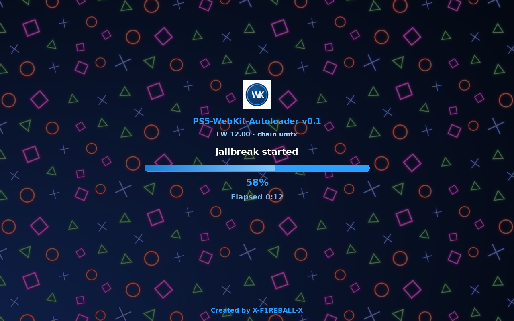

# PS5-WebKit-Autoloader

Version 0.2.2

Jailbreak from the PS5 homescreen.

**Created by X-F1REBALL-X**

**Download:** [Releases](https://github.com/X-F1REBALL-X/PS5-WebKit-Autoloader/releases)

## Firmwares

| Firmware | Status |
| --- | --- |
| **1.00 – 5.50** | Works |
| **6.xx** | No |
| **7.00 – 12.00** | Works |
| **12.02 – 12.70** | Works |
| **13.xx** | No (offsets only) |

## Install

1. Jailbreak with [sjb](https://x-f1reball-x.github.io/sjb/) ([repo](https://github.com/X-F1REBALL-X/sjb)) — it can auto-send this installer after JB.
2. Or download the `.elf` from Releases and send it to the ELF loader.
3. Open the homescreen app and run the jailbreak.

## Notes

- Keep only the current Release on GitHub.
- Short English release notes (for example: System fixes).
